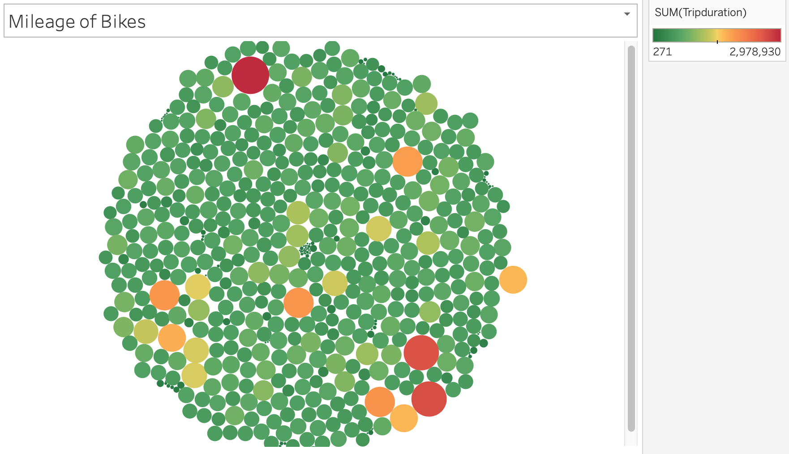
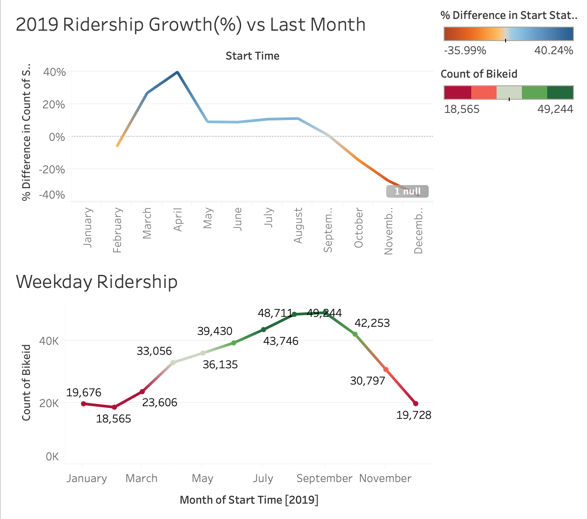
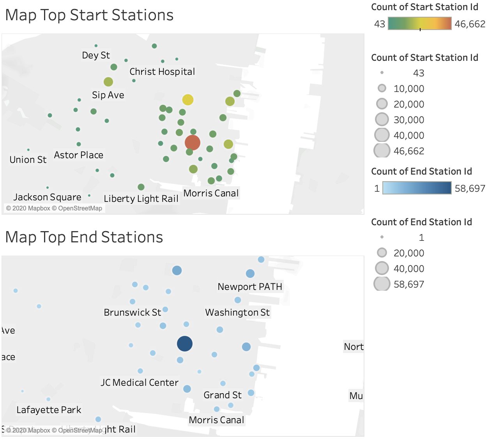
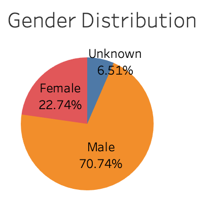
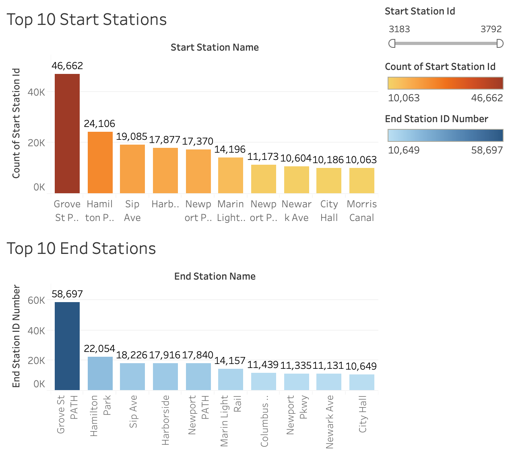
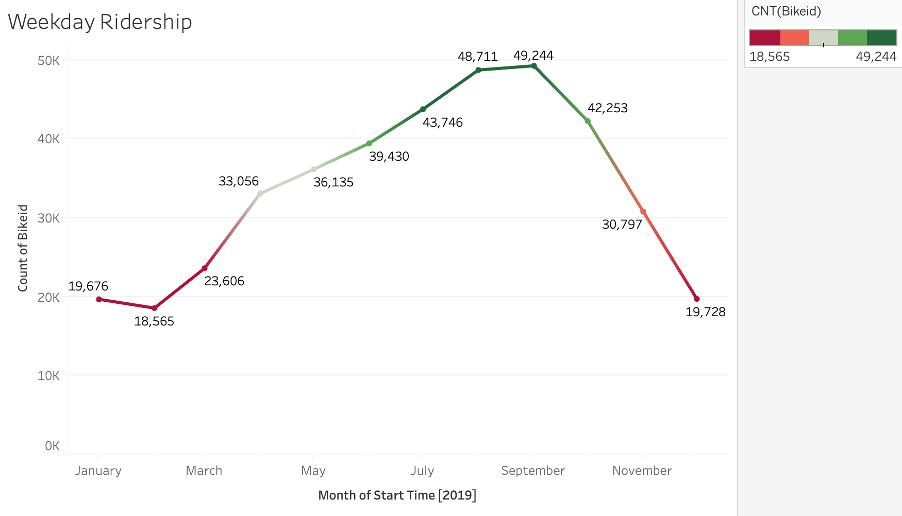

# Citibike-Analytics

An analysis for the New York Citi Bike Program, which ia responsible for overseeing the largest bike sharing program for 200,000+ data points in the United States in order to generate business insights and visulize various trends during the entire 2019 year. 

Click [here](https://public.tableau.com/profile/aditya.bhatnagar3494#!/vizhome/2019CitiBikeAnalysis/MileageofBikes?publish=yes) to view the completed dashboard.

# Data Source
https://www.citibikenyc.com/system-data

# Findings
1) During the year 2019, over 70% of the riders comprised of males while the 22% were female and the rest unknown. 

2) Grove St. Path station followed by the Hamilton Park are the most popular starting as well as ending stations.

3) The weekday ridership is peaks during the months of Aug-Sep after which a steep fall is observered which reached its trough during the months of Jan-Feb. 

